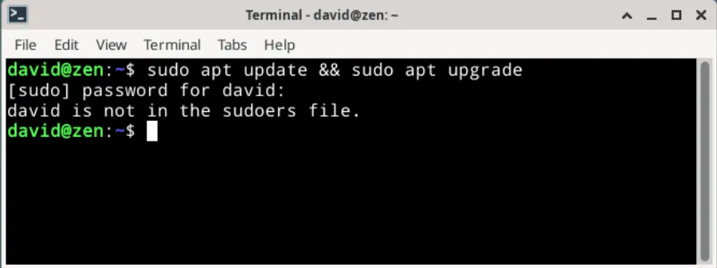
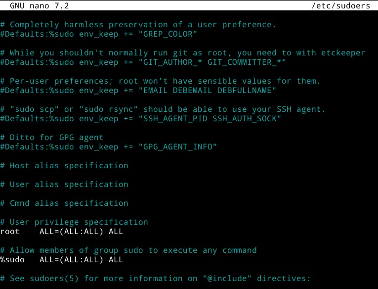

+++
title =  "Debian - Help, I’m not in the sudoers file!!"
date =   "2023-09-16"

[taxonomies]
tags = ["debian"]
+++

What do you do if you get the message **"Username is not in the sudoers file. This incident will be reported."**

<!-- more -->

It may be that having installed a new Debian desktop (in my case XFCE4) and you try to update (i.e. "**$ sudo apt update && sudo apt upgrade**") you end up with the following error message:




The message is just a warning on your local machine.  It shows that you attempted to gain root access and were not an authorised user.  To add yourself to the sudoers file you will firstly need, through your terminal, to login as root, i.e.

```bash
$ su
```

In the same terminal you now need to open the sudoers file in order to edit it. I am opening the sudoers file using nano:

```bash
$ nano /etc/sudoers
```

Scroll down to this entry,

```bash
#User privilege specification
root   ALL=(ALL:ALL) ALL
```



You then want to add an additional line (i.e. `david ALL=(ALL) ALL`) to provide yourself with sudo privileges.  Your user name will obviously be different from mine but the entry should look something like this,


You can then save (CTRL+O) and exit (CTRL+X).

Close your terminal and re-open.

If you now try to update with "**$ sudo apt update && sudo apt upgrade**" you should find that your password is now accepted and updates will progress as normal.
