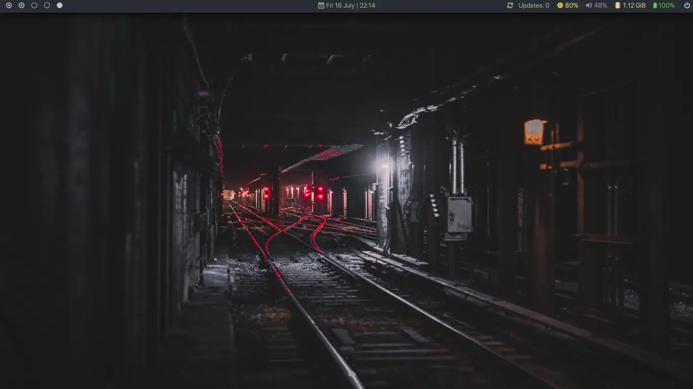

+++
title = "Useful bspwm Shorcuts"
date = "2021-07-17"
description = "Useful shortcuts for the window manager bspwm"
[taxonomies]
tags = ["window manager", "bspwm"]
+++

[bspwm](https://github.com/baskerville/bspwm) is a tiling window manager along the lines of [qtile](https://dajhub.co.uk/2021/07/03/Qtile-in-Manjaro.html) and [i3](https://i3wm.org).  The window manager, bspwm, does not handle any keyboard inputs and a third party program, [sxhkd](https://github.com/baskerville/sxhkd), is needed in order to translate keyboard events to navigate around bspwm.




Most of my keyboard shortcuts are the default from 'sxhkd'.  However, there are a few additions which have made navigation much easier for me.

## 1. Rotate an application around the current desktop
      
```bash
super + shift + {p,o}
      bspc node @/ -C {forward,backward}
```
The keys 'p' and 'o' can be changed for whatever you prefer - they just work for me!  If you use 'super + shift + p' this will move your windows in a clockwise direction around the desktop.

## 2. Expand/contract a window by moving one of its side outward/inward
There is a command in 'sxhkd' which allows you to expand and contract a window but, for me, it feels cumbersome and counter-intuitive.  The original sxhkd keyboard shortcuts are:

```bash
# expand a window by moving one of its side outward
      super + alt + {h,j,k,l}
      	bspc node -z {left -20 0,bottom 0 20,top 0 -20,right 20 0}

# contract a window by moving one of its side inward
      super + alt + shift + {h,j,k,l}
      	bspc node -z {right -20 0,top 0 20,bottom 0 -20,left 20 0}
```

For me a simpler method is as follows:

```bash
alt  {Left,Down,Up,Right}
      STEP=20; SELECTION={1,2,3,4}; \
      bspc node -z $(echo "left -$STEP 0,bottom 0 $STEP,top 0 -$STEP,right $STEP 0" | cut -d',' -f$SELECTION) || \
      bspc node -z $(echo "right -$STEP 0,top 0 $STEP,bottom 0 -$STEP,left $STEP 0" | cut -d',' -f$SELECTION)
```

## 3. Focus the next/previous desktop in the current monitor
This one took me a while to find but one which I really wanted.  It allows you to rotate through your desktops - in my case I have 5.  The shortcut makes it a breeze to move through them, either backwards or forwards:

```bash
      super + bracket{left,right}
      	bspc desktop -f {prev,next}.local
```

If needed, my configuration file can be found on my [GitLab](https://gitlab.com/dajhub/bspwm/-/blob/main/.config/sxhkd/sxhkdrc?ref_type=heads) page.
