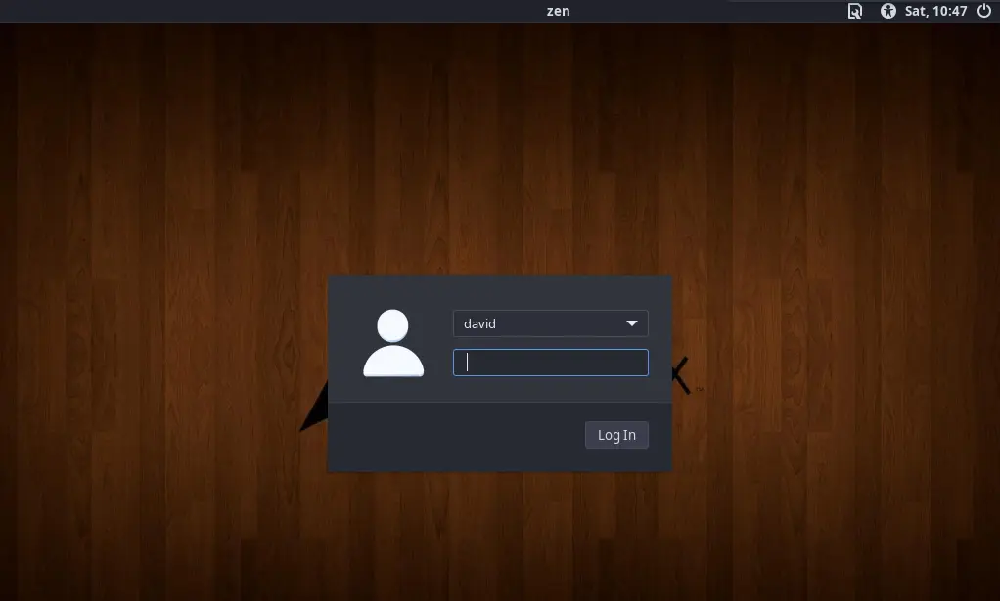
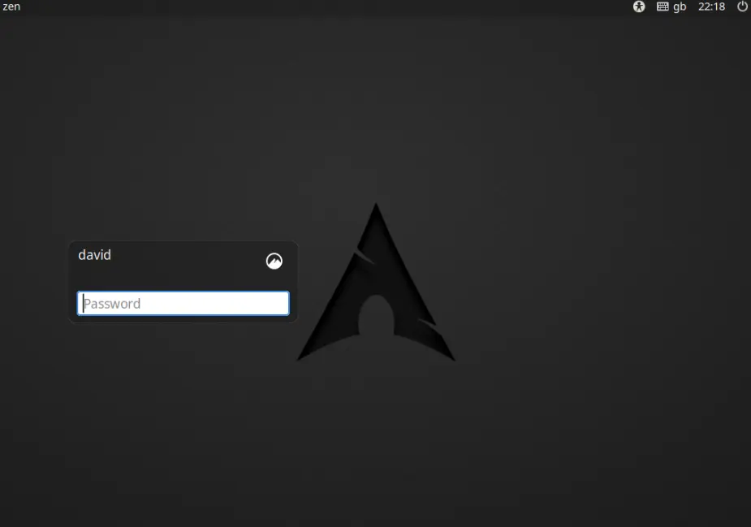

+++
title = "Changing Display Manager from LightDM to Slick Greeter"
date = "2022-04-16"
description = "Changing your graphical display manager in Linux"
[taxonomies]
tags = ["arch", "display manager"]
+++

Display managers provide you with a graphical login for your Linux distrbution.  Below is an example of the [LightDM](https://en.wikipedia.org/wiki/LightDM) display manager which is on my current Arch install:



An alternative display manager is [slick-greeter](https://github.com/linuxmint/slick-greeter) which uses LightDM but is [Linux Mint’s](https://linuxmint.com/) Cinnamon desktop own version.  There are some, including me, that believe it is a more attractive display manager than the default LightDM display manager.

## Installing Slick-greeter

To install slick-greeter on Arch via your terminal:

```bash
$ sudo pacman -S lightdm-slick-greeter
```

## Changing the Default Greeter Session

Once you have installed slick-greeter you need to change the default greeter session, which is LightDM.  In your terminal:

```bash
$ sudo nano /etc/lightdm/lightdm.conf
```

Once opened, scroll down to the line [Seat:*]. About sixteen lines below this you will see a line which looks like:

```
greeter-session=lightdm-gtk-greeter
```

The line needs to be changed to:

```bash
greeter-session=lightdm-slick-greeter
```

Save the file with the modification you have made using Ctrl+O.  To exit nano use Ctrl+X.

Next, as root open nano again

```bash
$ sudo nano /etc/lightdm/slick-greeter.conf 
```

The file will not exist, so nano will create it.  You can then add the following lines (source: https://github.com/linuxmint/slick-greeter) to slick-greeter.conf.

```bash
# LightDM GTK+ Configuration
# Available configuration options listed below.
#
# activate-numlock=Whether to activate numlock. This features requires the installation of numlockx. (true or false)
# background=Background file to use, either an image path or a color (e.g. #772953)
# background-color=Background color (e.g. #772953), set before wallpaper is seen
# draw-user-backgrounds=Whether to draw user backgrounds (true or false)
# draw-grid=Whether to draw an overlay grid (true or false)
# show-hostname=Whether to show the hostname in the menubar (true or false)
# show-power=Whether to show the power indicator in the menubar (true or false)
# show-a11y=Whether to show the accessibility options in the menubar (true or false)
# show-keyboard=Whether to show the keyboard indicator in the menubar (true or false)
# show-clock=Whether to show the clock in the menubar (true or false)
# show-quit=Whether to show the quit menu in the menubar (true or false)
# logo=Logo file to use
# other-monitors-logo=Logo file to use for other monitors
# theme-name=GTK+ theme to use
# icon-theme-name=Icon theme to use
# font-name=Font to use
# xft-antialias=Whether to antialias Xft fonts (true or false)
# xft-dpi=Resolution for Xft in dots per inch
# xft-hintstyle=What degree of hinting to use (hintnone/hintslight/hintmedium/hintfull)
# xft-rgba=Type of subpixel antialiasing (none/rgb/bgr/vrgb/vbgr)
# onscreen-keyboard=Whether to enable the onscreen keyboard (true or false)
# high-contrast=Whether to use a high contrast theme (true or false)
# screen-reader=Whether to enable the screen reader (true or false)
# play-ready-sound=A sound file to play when the greeter is ready
# hidden-users=List of usernames that are hidden until a special key combination is hit
# group-filter=List of groups that users must be part of to be shown (empty list shows all users)
# enable-hidpi=Whether to enable HiDPI support (on/off/auto)
# only-on-monitor=Sets the monitor on which to show the login window, -1 means "follow the mouse"
# stretch-background-across-monitors=Whether to stretch the background across multiple monitors (false by default)
# clock-format=What clock format to use (e.g., %H:%M or %l:%M %p)
[Greeter]
draw-grid=false
background=/usr/share/backgrounds/archlinux.png
```

The #'s mean that the options are not being used but can become active by uncommenting.  See the last two lines as an example. Change the "background=" to whatever background file you desire. Save the file as before with Ctrl+O and then Ctrl+X.

## The Result!!

After restarting your computer the new login screen looks as follows:



