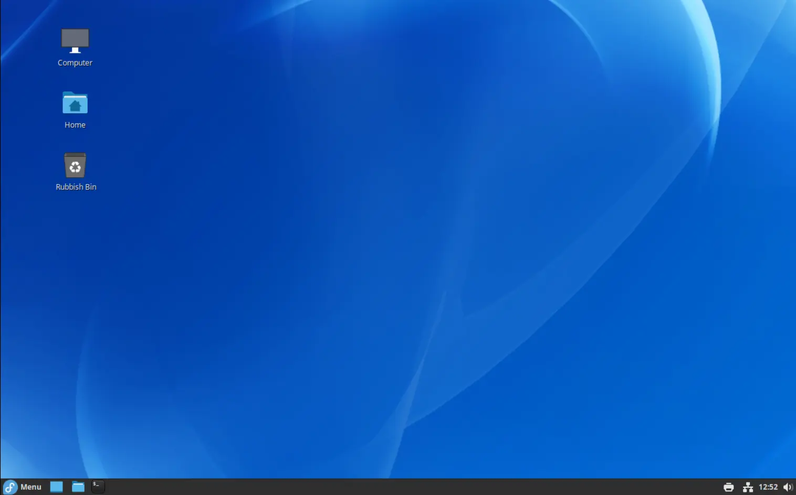
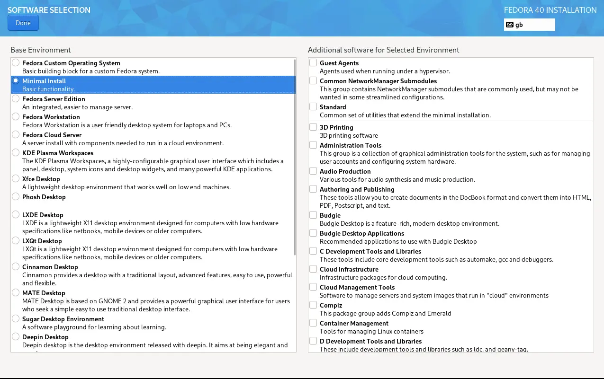
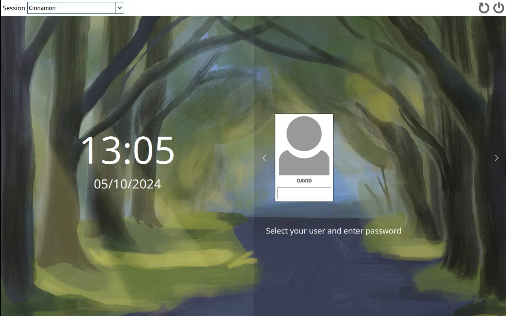
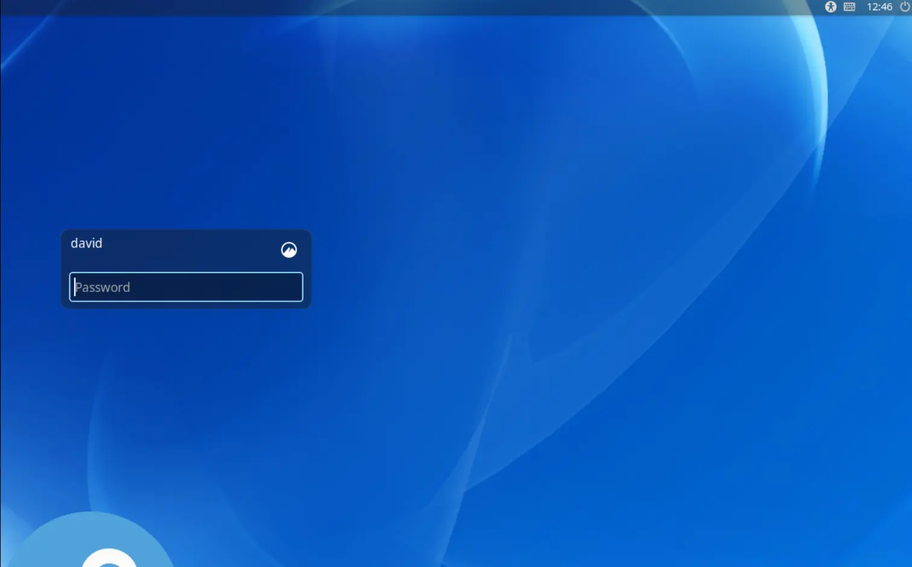

+++
title = "Fedora: Minimal Cinnamon Desktop Install"
date = "2024-10-04"
description = "Installing a minimal version of the Fedora Cinnamon desktop"
[taxonomies]
tags = ["desktop", "cinnamon"]
+++


# Fedora: Minimal Cinnamon Desktop Install

Fedora offers a specific spin for [Cinnamon Desktop](https://fedoraproject.org/spins/) but if you are looking for a more minimal install which doesn't include, for example, dnfdragora, LibrOffice, HexChat, Pidgin, Thunderbird, Transmission, Rhythmbox, XawTV Television Viewer, etc., then this post might be of interest.



To make a minimal Fedora install you will need to download the iso from the **Fedora Everything** [page](https://fedoraproject.org/everything/download).  The Fedora installer takes you through the installation process in clear steps.  Importantly, when you get to the page/step shown below ensure that you only select ***Minimal Install**.
	


With the installation complete, reboot and login with your username and password. In the terminal which loads:

```bash
sudo dnf install cinnamon* @base-x -y
```

You will also want to install some essentials, e.g.

```bash
sudo dnf install nemo-fileroller gnome-terminal firefox
```

# Display Manager

The display manager or login manager is where you input your username and password to get to your desktop.  The display manager I use is [sddm](https://github.com/sddm/sddm), which is the default for KDE. The Cinnamon default is [slick-greeter](https://github.com/linuxmint/slick-greeter). Insalling and enable either option is shown below.  For sddm,

```bash
sudo dnf install sddm
```

or for slick-greeter

```bash
sudo dnf install lightdm slick-greeter
```

## Enabling the Display Manager

If you have installed **sddm** then you will need to enable it. In a terminal,

```bash
systemctl enable sddm
systemctl set-default graphical.target
```



In the next post I will show how to improve the look of the sddm display manager.

To enable **slick greeter**

```bash
systemctl enable lightdm
systemctl set-default graphical.target
```




# Connecting to Wi-Fi

If you are installing the desktop onto a laptop then you might also need to connect to Wi-Fi.  In a terminal,

```bash
sudo dnf install NetworkManager-wifi iwl*
```

You may need to reboot for the changes to take effect.


