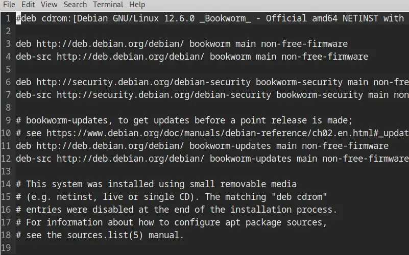
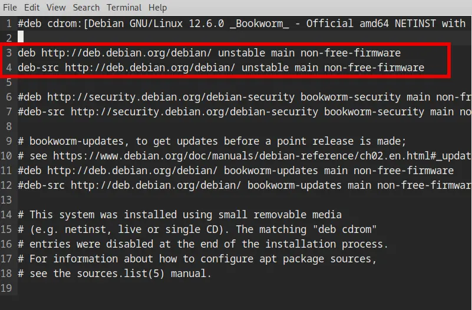

+++
title =  "Moving to Debian Unstable"
date =   "2024-08-05"
description = "An option if you are looking for more up-to-date software."
[taxonomies]
tags = ["debian"]
+++

Debian is often chosen for its stability and for a system that just works.  However, that stability often means that packages can become out of date.  Moving to the **unstable** branch might be an option.

Debian Unstable will provide you with newer packages, but there are inherent risks of breakages, since the packages have not been fully tested. If you do move to Unstable, it's probably best not to do it on a critical machine where you need guaranteed stability. With that said, the steps to move from Debian Stable to Unstable:

1. Using an editor such as nano, micro or vim open the Apt Sources file.  Apt downloads packages from one or more software repositories (sources) and installs them onto your computer.

    ```bash
    sudo micro /etc/apt/sources.list
    ```
    

2. In the `sources.list` there needs to be only two entries (see screenshot below):

    ```bash
    deb http://deb.debian.org/debian/ unstable main non-free-firmware
    deb-src http://deb.debian.org/debian/ unstable main non-free-firmware
    ```

    The other entries/sources can be commented out using the **`#`** at the beginning of the line.  This will stop them from running.  You can also delete the unneeded sources if desired.

    

3. Next, to update the sources list run

    ```bash
    sudo apt update && sudo apt full-upgrade
    ```

    This may take some time.


 

In order to make your life easier in the Unstable version install the apt-listbugs and apt-listchanges packages so that you are notified "*of grave bugs or important changes when you install new packages or during an upgrade.*" <sup>[1](#debian_unstable)</sup>

```bash
sudo apt update && sudo apt install apt-listbugs apt-listchanges
```

There is additional debian guidance for Unstable/Sid user which it is worth taking note of in the link below.




---

**Sources:**

<a name="debian_unstable">1</a>: [Debian Best Practices for Sid/Unstable Users](https://wiki.debian.org/DebianUnstable#:~:text=Install%20the%20apt%2Dlistbugs%20and,data%20is%20not%20a%20problem)
