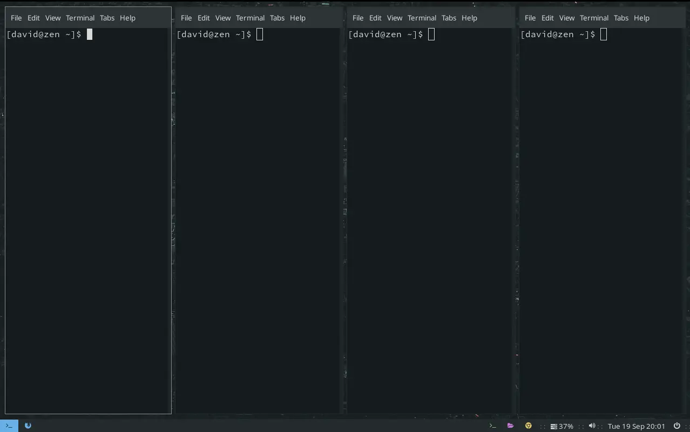
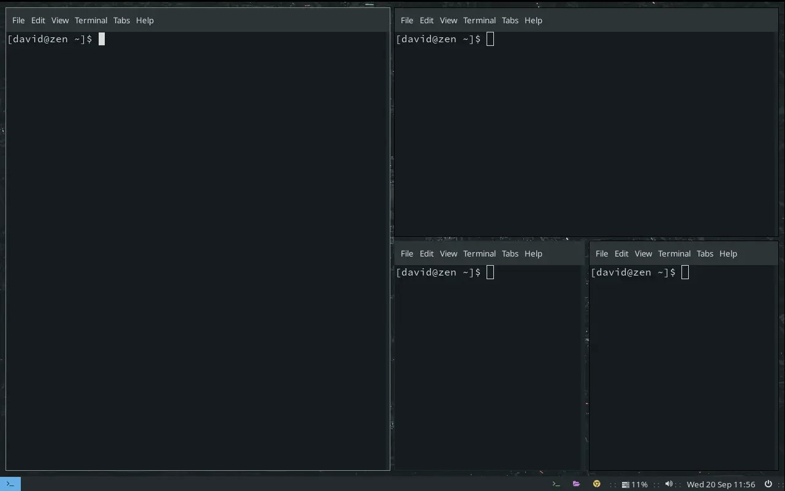

+++
title =  "i3 Window Manager - Spiral Tiling"
date =   "2023-09-22"
description = "How to introduce spiral tiling into the i3 window manager on Fedora."
[taxonomies]
tags = ["fedora","i3","window manager"]
+++

i3 is a tiling window manager which automatically places your windows to make the best use of the space available on your screen. 

The default tiling for i3 looks like:



My prefered tiling is a spiral layout as shown below.



To achieve this spiral tiling, Piotr Miller has created a fantastic script which can be found on his [GitHub page](https://github.com/nwg-piotr/autotiling/tree/master).    It is worth reading through the GitHub page before proceeding.  However, the process for installing autotiling script on **Fedora** is as follows:

1. To meet the requirements for installing the script you will need to install `pip`, which is a package manager for the Python coding language, and `13ipc`, which is a Python library for controlling the window manage (i3).  In a terminal:

	```bash
	sudo dnf install python3-pip
	pip install i3ipc
	```

2. Next, locate the file `main.py` in the GitHub page.  If you navigate to **View code** near the top of the GitHub page	and then find the folder **autotiling**.  In the **autotiling** folder, open the `main.py` file and copy the contents into a new file.  The new file has to be created called `autotiling`. For me, I created the new file in **Downloads** since we're going to move it shortly.  Having created the file but before moving it, we need to make the file executable:

	```bash
	chmod +x ~/Downloads/autotiling
	```

3. We can now move the file we have created to our bin folder located at /bin/ 

	```bash
	sudo mv ~/Downloads/autotiling /bin/
	```

4. To ensure that autotiling starts when i3 loads, we need to add the following script to our `config` file which is located in `~/.config/i3/`.

	```bash
	# autotiling script
	exec_always --no-startup-id autotiling
	```

5. You will need to log out and then login for the changes to take effect.


