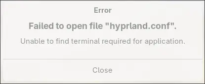
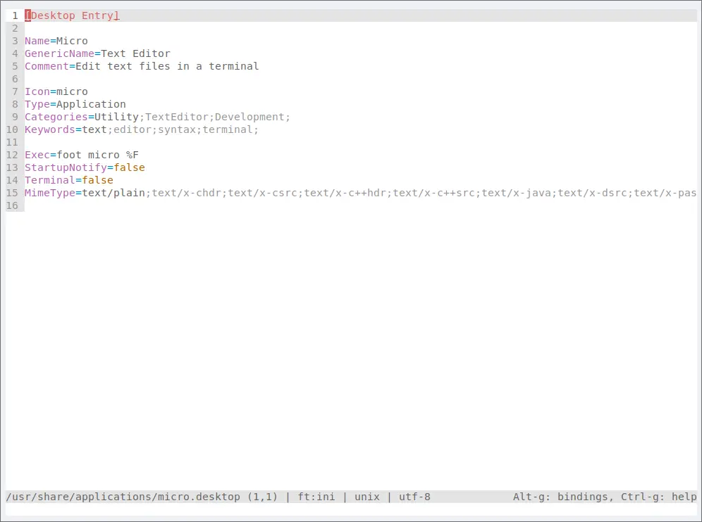

+++
title = "Micro Text Editor: Right Click a File in Thunar to Open in Micro"
date = "2025-05-30"
[taxonomies]
tags = ["software"]
+++


Using the Micro text editor has been a joy, but it does require sorting a few things to make it comfortable to use.  A problem I came across was in the file manager Thunar when I right-clicked on a file to open it in the Micro editor, I would get an error message "Unable to find terminal required for application".

<!-- more -->



This is a simple problem to correct.  In a terminal open the following file:

```bash
sudo micro /usr/share/applications/micro.desktop
```

Change the line that reads

> Exec = micro %F

to 

> Exec = foot micro %F

Next, go to the line that reads

> Terminal = true

and change it to 

> Terminal = false

The final file should look as follows:


