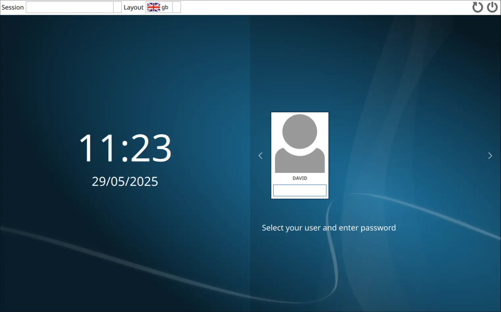
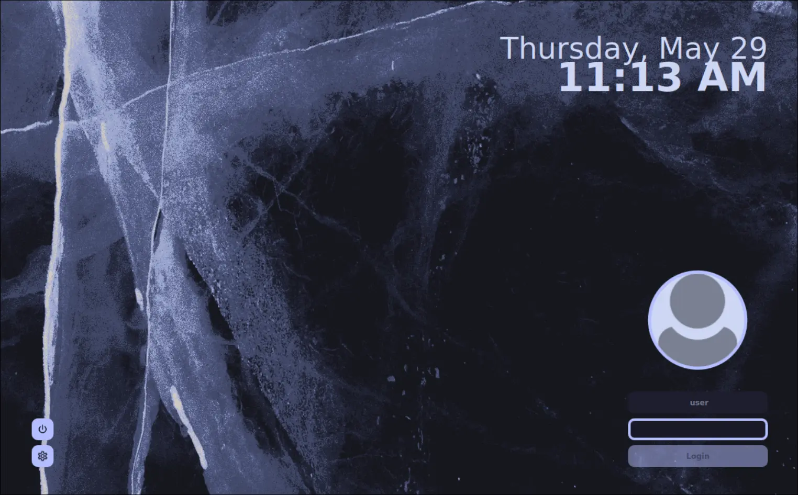
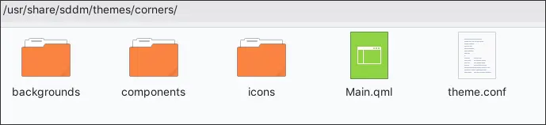
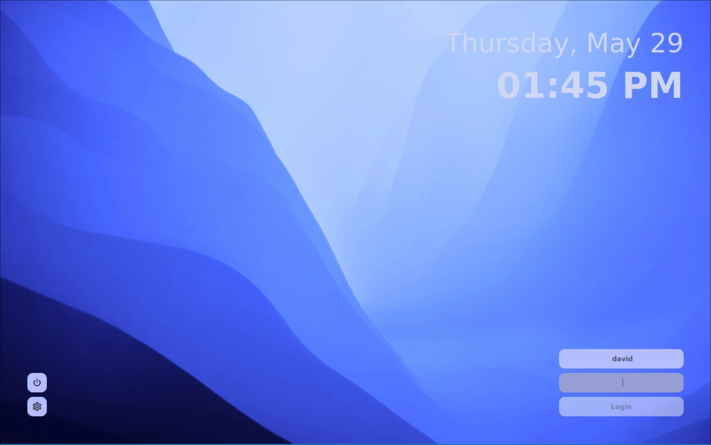

 +++
title = "Changing the SDDM Display Manager (non-KDE)"
date = "2025-05-29"
description = "How to install and edit an SDDM theme." 
[taxonomies]
tags = ["display manager", "software"]
+++

While I do not use the KDE desktop I do like its display manager, SDDM.  The default SDDM theme is not, in my opinion, very visually appealing (see image below) but it can be changed.  This post looks at how we can change the theme and then edit it to our liking.  I am currently using Arch but there will be similarities with other Linux Distribution such as Fedora and Debian.


# Installing the SDDM Display Manager



In Arch, if you install and enable the sddm display manager (see terminal commands below) it will look similar to the screenshot above.  The [Fedora sddm display manager](https://dajhub.co.uk/blog/cinnamon-fedora-minimal/#enabling-the-display-manager) will look slightly different.

```bash
sudo pacman -S sddm
sudo systemctl enable sddm.service
```


# Install an SDDM Theme

I have found the [sddm corners theme](https://github.com/aczw/sddm-theme-corners) easy to install (in a non-KDE environment) and also easy to edit.  Instructions for installation can be found on their [site](https://github.com/aczw/sddm-theme-corners?tab=readme-ov-file#installation).  The theme can be found in Arch's AUR. To install:

```bash
# Install dependencies
paru -Syu sddm qt5-graphicaleffects qt5-svg qt5-quickcontrols2

# Install corners theme
paru -S sddm-theme-corners-git

# Makes it the default theme. 
echo "[Theme]
Current=corners" | sudo tee /etc/sddm.conf

# Enable sddm service if this has not already been done above.  Use -f if needed.
sudo systemctl enable sddm.service
```

SDDM with the new theme applied:




# Making Changes to the Corners Theme

With the new theme installed we can easily tweak it.  The theme is located in `/usr/share/sddm/themes/corners/`



Changes that I have made:

- replaced the background image, located in `/usr/share/sddm/themes/corners/bacgrounds`
- widening the vertical gap between the date and time which seemed too close to me
- removing the user picture
- changing the look of the login details in the bottom right

The result:



To achieve the above you need to open the configuration file for the **corners** theme.  I use **micro** as my editor but you may be using **nano** or **vim**.

```bash
sudo micro /usr/share/sddm/themes/corners/theme.conf
```
The contents of the **original** file:

```bash
1	## Please see https://github.com/aczw/sddm-theme-corners/blob/main/CONFIG.md for
2	## more information about these options. Happy configuring!
3	
4	[General]
5	
6	# BgSource: string. Path to an image, used as the wallpaper. Can be placed
7	# in the `backgrounds/` folder for convenience (see below!)
8	#
9	# FontFamily: string. Name of the font family. You can find this with
10	# something like `fontconfig`, for example.
11	#
12	# FontSize: number. This value is used for everything *except* the date/time.
13	#
14	# Padding: number. How far away things should be from the edge of your screen.
15	#
16	# Radius: number. Corner radius for UI. Set to 0 to disable rounded corners.
17	#
18	# Scale: number. Adjusts the size of UI elements. Can be anything, but I
19	# would stick between 1 and 2 (e.g. 1.5).
20	
21	BgSource="backgrounds/glacier.png"
22	FontFamily="Atkinson Hyperlegible"
23	FontSize=9
24	Padding=50
25	Radius=10
26	Scale=1
27	
28	# UserPictureEnabled: boolean. By default the user picture is shown. Set to false
29	# if you don't have/want a user picture, or you don't use the
30	# user selection functionality.
31	#
32	# UserBorderWidth: number. Width of the border around your picture. Set to
33	# 0 to remove.
34	#
35	# UserBorderColor: color. Border color around your picture. Useless if border
36	# width is 0.
37	#
38	# UserColor: color. Background color of the default, blank avatar. Only
39	# visible if you don't have your own picture.
40	
41	UserPictureEnabled=true
42	UserBorderWidth=5
43	UserBorderColor="#b4befe"
44	UserColor="#cdd6f4"
45	
46	# InputColor: color. Background color of the input fields.
47	#
48	# InputTextColor: color. Color of text you enter in the fields.
49	#
50	# InputBorderWidth: number. Width of the border around the active field. Set
51	# to 0 to remove.
52	#
53	# InputBorderColor: color. Border color of active field. Useless if border
54	# width is 0.
55	#
56	# UserPlaceholderText: string. Placeholder text shown when user field is empty.
57	#
58	# PassPlaceholderText: string. Placeholder text shown when user field is empty.
59	#
60	# HidePassword: boolean. Whether to replace your entered password with dots.
61	
62	InputColor="#1e1e2e"
63	InputTextColor="#cdd6f4"
64	InputBorderWidth=4
65	InputBorderColor="#b4befe"
66	UserPlaceholderText="user"
67	PassPlaceholderText="password"
68	HidePassword=true
69	
70	# LoginButtonTextColor: color. Text color on the login button.
71	#
72	# LoginButtonText: string. Text displayed on the button.
73	#
74	# LoginButtonColor: color. Background color of the button.
75	
76	LoginButtonTextColor="#1e1e2e"
77	LoginButtonText="Login"
78	LoginButtonColor="#b4befe"
79	
80	# PopupColor: color. Background color of popup window.
81	#
82	# PopupActiveColor: color. Color around the currently selected entry.
83	#
84	# PopupActiveTextColor: color. Text color of the currently selected entry.
85	# Mainly provided for potential contrast issues.
86	
87	PopupColor="#b4befe"
88	PopupActiveColor="#1e1e2e"
89	PopupActiveTextColor="#cdd6f4"
90	
91	# SessionButtonColor: color. Session button background color.
92	#
93	# SessionIconColor: color. Color of the icon inside the session button.
94	#
95	# PowerButtonColor: color. Power button background color.
96	#
97	# PowerIconColor: color. Color of the icon inside the power button.
98	
99	SessionButtonColor="#b4befe"
100	SessionIconColor="#1e1e2e"
101	PowerButtonColor="#b4befe"
102	PowerIconColor="#1e1e2e"
103	
104	# DateTimeSpacing: number. Spacing between the date and time.
105	#
106	# Date/TimeColor: color. Date/time text color.
107	#
108	# Date/TimeSize: number. Font size for the date/time.
109	#
110	# Date/TimeIsBold: boolean. Whether date/time text should be bolded.
111	#
112	# Date/TimeOpacity: number. Date/time text opacity.
113	#
114	# Date/TimeFormat: string. Change the format of how the date and time is displayed.
115	# Note that they use different formats.
116	
117	DateTimeSpacing=-20
118	
119	DateColor="#cdd6f4"
120	DateSize=36
121	DateIsBold=false
122	DateOpacity=1.0
123	DateFormat="dddd, MMMM d"
124	
125	TimeColor="#cdd6f4"
126	TimeSize=48
127	TimeIsBold=true
128	TimeOpacity=1.0
129	TimeFormat="hh:mm AP"
```

The changes I then made to the above config file:

```text
line 21 BgSource="backgrounds/light-blue-layers.jpg" #changed the background
line 41 UserPictureEnabled=false #removes the login image/picture
line 62 InputColor="#b4befe"
line 63 InputTextColor="#4c4f69"
line 64 InputBorderWidth=0 #changed from 4 to 0
line 76 LoginButtonTextColor="#4c4f69"
line 78 LoginButtonColor="#eff1f5"
line 117 DateTimeSpacing=10 #changed from -20 to 10 to improve space between date & time
```

However, I might, in the near future, change the color of the date and time to improve the contrast with the background.  The white text does not really work on the light background.

Below is the full config file for the updated theme:

```bash
## Please see https://github.com/aczw/sddm-theme-corners/blob/main/CONFIG.md for
## more information about these options. Happy configuring!

[General]

# BgSource: string. Path to an image, used as the wallpaper. Can be placed
# in the `backgrounds/` folder for convenience (see below!)
#
# FontFamily: string. Name of the font family. You can find this with
# something like `fontconfig`, for example.
#
# FontSize: number. This value is used for everything *except* the date/time.
#
# Padding: number. How far away things should be from the edge of your screen.
#
# Radius: number. Corner radius for UI. Set to 0 to disable rounded corners.
#
# Scale: number. Adjusts the size of UI elements. Can be anything, but I
# would stick between 1 and 2 (e.g. 1.5).

BgSource="backgrounds/light-blue-layers.jpg"
FontFamily="Atkinson Hyperlegible"
FontSize=9
Padding=50
Radius=10
Scale=1

# UserPictureEnabled: boolean. By default the user picture is shown. Set to false
# if you don't have/want a user picture, or you don't use the
# user selection functionality.
#
# UserBorderWidth: number. Width of the border around your picture. Set to
# 0 to remove.
#
# UserBorderColor: color. Border color around your picture. Useless if border
# width is 0.
#
# UserColor: color. Background color of the default, blank avatar. Only
# visible if you don't have your own picture.

UserPictureEnabled=false
UserBorderWidth=5
UserBorderColor="#b4befe"
UserColor="#cdd6f4"

# InputColor: color. Background color of the input fields.
#
# InputTextColor: color. Color of text you enter in the fields.
#
# InputBorderWidth: number. Width of the border around the active field. Set
# to 0 to remove.
#
# InputBorderColor: color. Border color of active field. Useless if border
# width is 0.
#
# UserPlaceholderText: string. Placeholder text shown when user field is empty.
#
# PassPlaceholderText: string. Placeholder text shown when user field is empty.
#
# HidePassword: boolean. Whether to replace your entered password with dots.

InputColor="#b4befe"
InputTextColor="#4c4f69"
InputBorderWidth=0
InputBorderColor="#b4befe"
UserPlaceholderText="user"
PassPlaceholderText="password"
HidePassword=true

# LoginButtonTextColor: color. Text color on the login button.
#
# LoginButtonText: string. Text displayed on the button.
#
# LoginButtonColor: color. Background color of the button.

LoginButtonTextColor="#4c4f69"
LoginButtonText="Login"
LoginButtonColor="#eff1f5"

# PopupColor: color. Background color of popup window.
#
# PopupActiveColor: color. Color around the currently selected entry.
#
# PopupActiveTextColor: color. Text color of the currently selected entry.
# Mainly provided for potential contrast issues.

PopupColor="#b4befe"
PopupActiveColor="#1e1e2e"
PopupActiveTextColor="#cdd6f4"

# SessionButtonColor: color. Session button background color.
#
# SessionIconColor: color. Color of the icon inside the session button.
#
# PowerButtonColor: color. Power button background color.
#
# PowerIconColor: color. Color of the icon inside the power button.

SessionButtonColor="#b4befe"
SessionIconColor="#1e1e2e"
PowerButtonColor="#b4befe"
PowerIconColor="#1e1e2e"

# DateTimeSpacing: number. Spacing between the date and time.
#
# Date/TimeColor: color. Date/time text color.
#
# Date/TimeSize: number. Font size for the date/time.
#
# Date/TimeIsBold: boolean. Whether date/time text should be bolded.
#
# Date/TimeOpacity: number. Date/time text opacity.
#
# Date/TimeFormat: string. Change the format of how the date and time is displayed.
# Note that they use different formats.

DateTimeSpacing=10

DateColor="#cdd6f4"
DateSize=36
DateIsBold=false
DateOpacity=1.0
DateFormat="dddd, MMMM d"

TimeColor="#cdd6f4"
TimeSize=48
TimeIsBold=true
TimeOpacity=1.0
TimeFormat="hh:mm AP"
```
