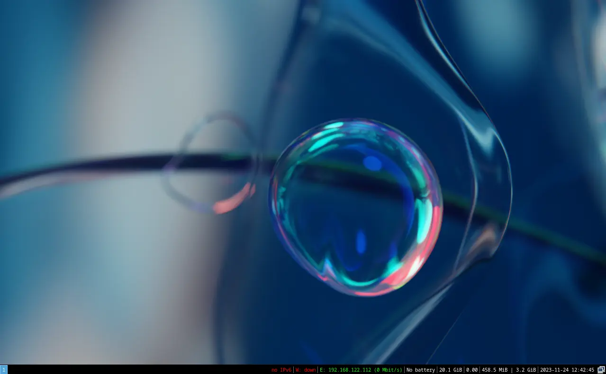
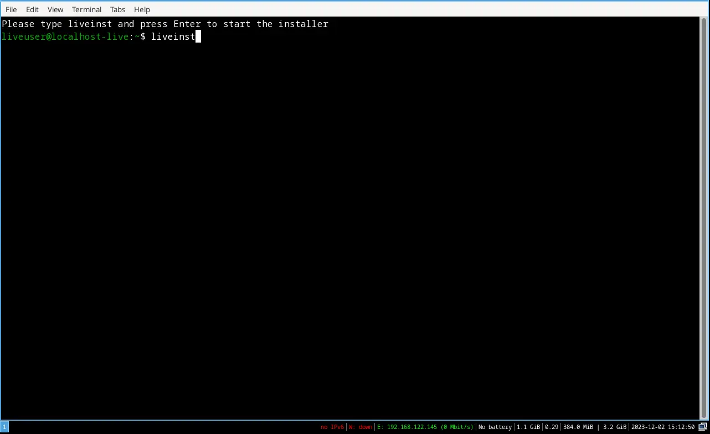
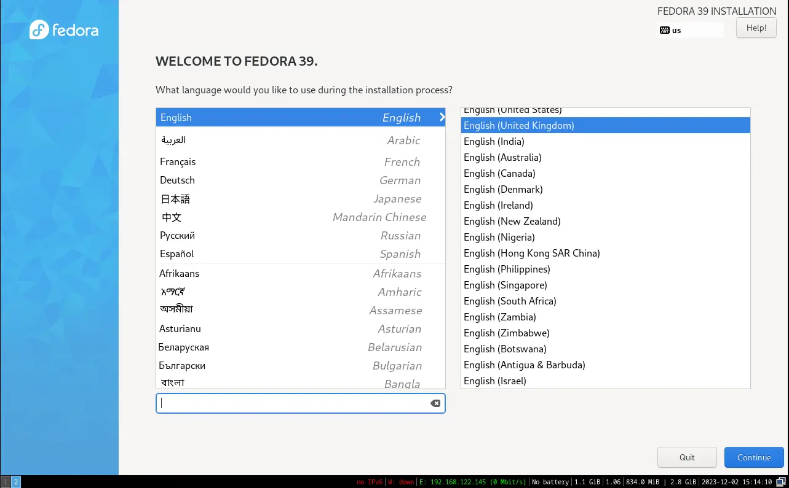
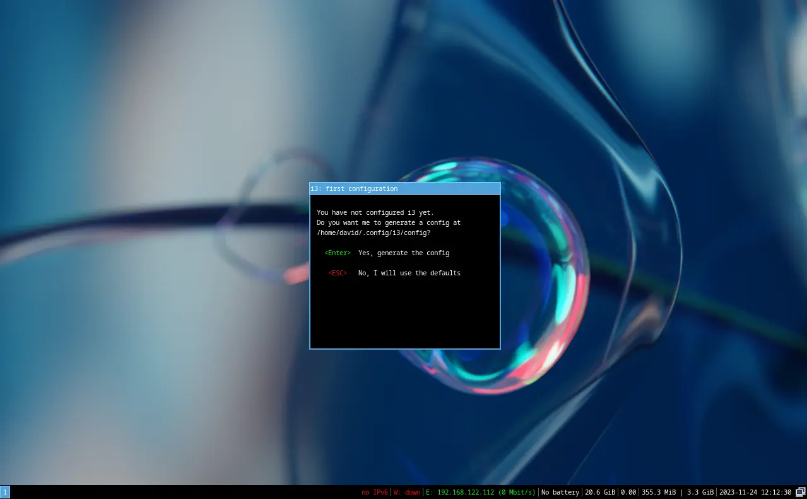
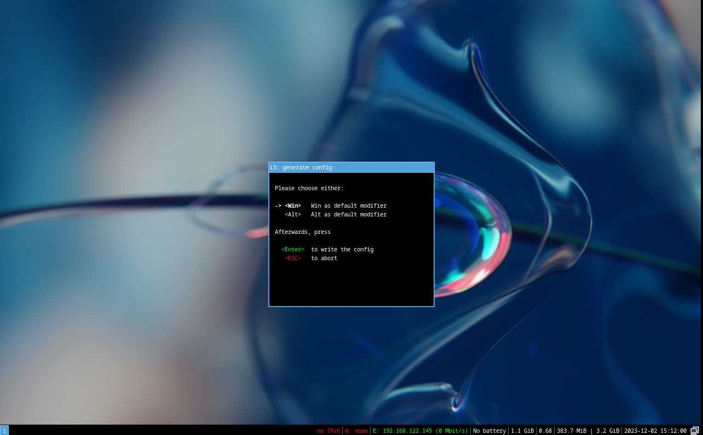
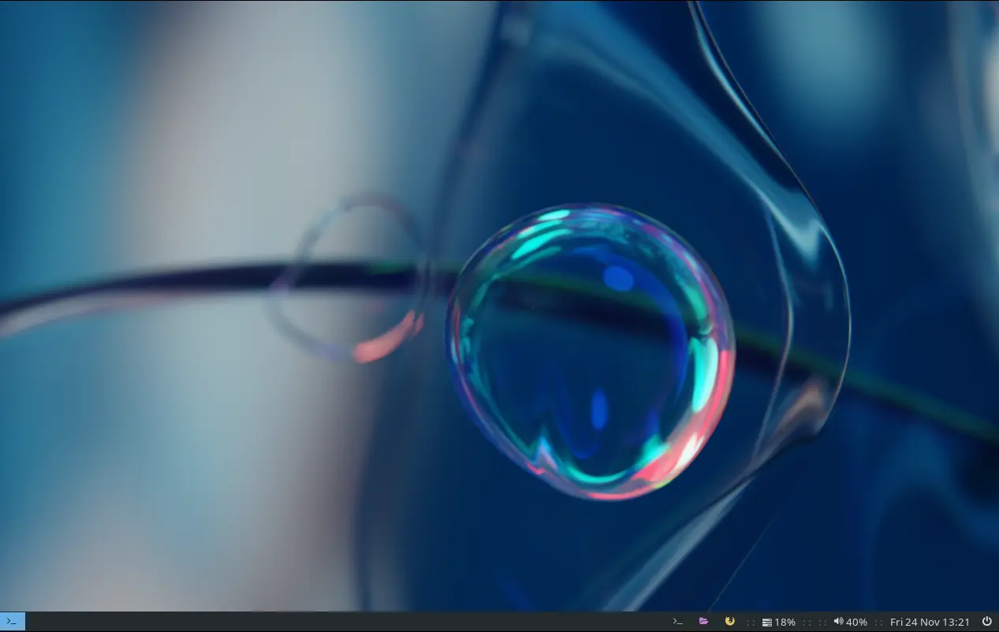

+++
title = "Ricing Fedora i3"
date = "2023-11-26"
description = "Ricing Fedora i3"
[taxonomies]
tags = ["fedora","i3","window manager"]
+++

This brief article looks at installing i3 on Fedora and some basic theming/ricing to improve on Fedora's pretty bare bones look (see the image below)!!  To get started we firstly need to install i3.




## 1.0 Installing i3 on Fedora

The download for Fedora's i3 spin can be found on their [spins](https://fedoraproject.org/spins/i3/download) page.

To install Fedora i3 you will need to transfer the downloaded file to a bootable medium, which is usually an USB stick.  

1. Once the bootable medium is on your usb stick, insert the stick into the computer and then restart your computer.  Usually when you restart your computer it will boot into your current operating system, e.g. Windows.  However, before this happens you should see your BIOS loading screen... there will be a key to press which will allow your computer to boot on your USB.  For me the key is F12 which I press repeatedly on restarting the computer.  For others the key might be Escape, F1, F2, F8, F10, F11, or Delete.  The key for your computer will either be in your documentation or it will usually be briefly shown on the screen during the boot procedure.

2. With i3 loaded from your USB you will need to press ```Meta+Enter``` to open a terminal.

    
    'Meta' is the Windows key on your keyboard
    

	There should be a message in your newly opened terminal on how to start the i3 installation process.

	

	The installer used by Fedora is __Ananconda__ which is very user friendly.  The image below shows the first step in the installation process.  

	

	Every persons installation is going to be slightly different and there are loads of guides out there on installing Fedora, so we won't go through all the installation steps.

	Once you have i3 installed, restart your computer and when prompted accept the two i3 defaults (see below).  Don't worry, we will be changing these defaults shortly.

3. Accepting the default below will install a default __configuration file__ which we will soon be changing.

     

4. In i3 the __$mod key__ is extremely important since it allows you to navigate around the windows manager.  For example, you will use it to move to different workspaces, change your layouts, and open new applications.  We've already used it to open a terminal in i3!  We are accepting the default $mod key which is the Windows key, i.e. select the green  'Enter' key.

	 

## 2.0 A Few Essential Tasks
Having installed i3 there are a few things you may want to do before we get into the theming your i3:

### 2.1 Update the system
```bash
sudo dnf update
```
  
### 2.2 Changing your hostname
In your terminal the hostname is given as `@fedora`.  If you want to change this to a different hostname then in your terminal...

```bash
sudo hostnamectl set-hostname "New_Custom_Name"
```
Replace ***"New_Custom_Name"*** with your choice of hostname.  This can be ignored if you're happy with the given hostname.
   
   ### 2.3 Install git
We will need this to get started with the theming.
```bash
sudo dnf install git
```

## 3.0 Basic i3 Keyboard Shortcuts
All the shortcuts can be found in the i3 configuration file: ~/.config/i3/config .  However, some of the main ones are:


- start a terminal (kitty):\
     __$mod+Return__
- start thunar:\
    __$mod+n__
- start firefox:\
    __$mod+w__
- start rofi:\
    __$mod+d__
- move between workspaces:\
    - a) workspace next:\
    __$mod+Tab__\
    - b) workspace prev:\
    __$mod+Shift+Tab__  \    
- Exit i3:\
    __$mod+Shift+e__
    


## 4.0 Installing alternative configuration files

In this section we will be installing, using the terminal, the i3 configuration files from my [GitLab](https://gitlab.com/dajhub/i3-dotfiles) account.  Please note that the source for my i3 configuration file comes from a modified version of the EndeavourOS [i3 theming](https://github.com/endeavouros-team/endeavouros-i3wm-setup); they come with some great settings, which I've basically tweaked to my own preferences. 

- The first step is to clone my GitLab repository:

    ```bash
    git clone https://gitlab.com/dajhub/i3-dotfiles.git
    ```
- Copy the following folders/files which have been downloaded from GitLab and place them in their correct locations.  Note that the first command will replace the original i3 configuration file, so you may want to create a copy of the file first, before going through the commands below.
   
    ```bash
    cp -r ~/i3-dotfiles/.config/i3/ ~/.config/
    cp -r ~/i3-dotfiles/.fonts/ ~/
    cp -r ~/i3-dotfiles/.icons/ ~/
    ```
- Additional applications which are required or useful that need to be installed:

    ```bash
    sudo dnf install rofi i3blocks picom kitty nitrogen lxappearance
    ```

    __Rofi__ is a window switcher, application launcher and a replacement for the default dmenu which comes with i3. __Picom__ is a compositor for Xorg and can, for example, allow drop shadows and transparency. __i3blocks__ is a status bar replacement for the i3bar. __Kitty__ is my preferred terminal but you can obviously replace this with alternatives, e.g. alacritty. __Nitrogen__ is a background browser and setter for X Window.  __Lxappearance__ is actually part of the LXDE project but is a theme switcher for GTK+.

For all the changes to take effect it is easiest to exit and restart i3.


mod + shift + e \
and then click __yes__ to exit


When you are logged back in the window manager, i3, should now looks as follows:



Notice that the __i3bar__ has now been replaced with the __i3blocks__ bar.  Next we need to change the background wallpaper and install the theme.

## 5.0 Theming/Ricing i3
### 5.1 Background Wallpaper
To change the wallpaper we will be using __nitrogen__.
- __meta + d__$mod+w__n, add the wallpaper by selecting __*'configuration'*__ and then adding the wallpaper which can be found in ~/.config/i3/wallpapers. Select the wallpaper and then click 'apply'.  


### 5.2 GTK Theme
The themes which I have used is [Everblush](https://github.com/Everblush).  I have installed the theme from their GitHub page.  The steps to install the theme on Fedora (via terminal) are:

```bash
sudo dnf install nodejs-npm make
git clone https://github.com/Everblush/gtk
cd gtk
sudo npm install -g scss
sudo make install
```
\
Having installed Everblush:
- Load __lxappearance__  and then select "Everblush".  

mod +d \
to load rofi
and then type in __lxappearance__


Still within __lxappeance__ you can select the __'Icon Theme'__  _Papirus-Dark_, and under __'Mouse Cursor'__  the _Vimix Cursors_.  The result for Thunar file manager should look something like the following:


### 5.3 Kitty
If you are using the Kitty terminal then you will need to theme it in order to pick up the Everblush theme.  

- Load the Everblush terminal configuration files from [github](https://github.com/Everblush/terminal-emulators/tree/main/src/kitty).  
- We need to follow the instruction on the site, "*Copy the contents of the Everblush.conf file into your kitty config (usually present at ~/.config/kitty/kitty.conf) and save the file.*" .  To do this via the terminal:

    ```bash
    cd ~/.config/kitty
    touch kitty.conf
    nano kitty.conf
    ```
The second command ('touch) will create an empty file called *kitty.conf* and the last command ('nano') will open the newly created file in nano, which is an easy to use command line text editor.  If you are, for example, using 'vim' then just replace nano with vim.

Having opened the new blank document, copy the contents of the Everblush kitty theme.  This can be found on the Everblush [github](https://github.com/Everblush/terminal-emulators/tree/main/src/kitty) site at the top (i.e. open the **Everblush.conf** file). Copy the content across into your blank kitty.conf file.

To save your new file in nano press ```Ctrl + o``` and then ```Ctrl + x``` to exit nano.  The image below shows Kitty with the Everblush theme.  For mine, I am showing **neofetch** for some contrast! If you want neofetch and don't already have it installed.... ```sudo dnf install neofetch```.  To run it, simply type ```neofetch```.



At the moment when you right click in the file manager, Thunar, and select __'Open Terminal Here"__, the terminal which is opened will be the xfce4-terminal.  To change this so that Kitty opens:

- In Thunar, go to 'Edit' and select "Configure custom actions...".
- Select the first entry in the dialogue box which should read "Open Terminal Here" and click the cog on the right-hand side, which will allow you to edit you choice of terminal.
- Change the ```Command``` to 'kitty'.


- Close and reopen Thunar.  Right clicking in the file manager should now open Kitty instead of the xfce4-terminal.



### 5.4 Firefox
If you want the Everblush theming in Firefox, [AlphaTechnolog](https://github.com/AlphaTechnolog/everblush-firefox) have created a good Everblush theme.  

To install the theme:
- Install the Firefox color [extension](https://color.firefox.com).
- On the AlphaTechnolog [GitHub](https://github.com/AlphaTechnolog/everblush-firefox) site/page click the 'link' at the bottom of the page.  The result...


##  6.0 Betterlockscreen
Betterlockscreen is a minimal lock screen.  The installation instructions are on their [GitHub](https://github.com/betterlockscreen/betterlockscreen) site.  As stated on their site, there are a number of system requirements for betterlockscreen to work. To do this on Fedora:
### 6.1 System Requirements
#### 6.1.1 Imagemagick

Used for editing and manipulating digital images.

```bash
sudo dnf install ImageMagick
```

#### 6.1.2 i3lock-color
A simple screen locker.... [i3lock-color](https://github.com/Raymo111/i3lock-color):
- Required dependencies for i3lock-color:
    ```bash
    sudo dnf install -y autoconf automake cairo-devel fontconfig gcc libev-devel libjpeg-turbo-devel libXinerama libxkbcommon-devel libxkbcommon-x11-devel libXrandr pam-devel pkgconf xcb-util-image-devel xcb-util-xrm-devel
    ```
- Building i3lock-color:
    ```bash
    git clone https://github.com/Raymo111/i3lock-color.git
    cd i3lock-color
    ./install-i3lock-color.sh
    ```

### 6.2 Installation of Betterlockscreen
The command is an automatic install for Betterlockscreen and is a `user-installation` rather than a `system-installation`.

```bash
sudo dnf install xset
wget https://raw.githubusercontent.com/betterlockscreen/betterlockscreen/main/install.sh -O - -q | bash -s user
```
The key combination __$mod+l__ will lock the screen with a black background.  If you want a blurred background image which randomly changes,

```bash
betterlockscreen -u ~/.config/i3/wallpapers/space-station.png
```
At the moment there is only one image in the folder; add more images to get the random changes.  The current effect is below:


For more options with betterlockscreen see their [github account examples](https://github.com/betterlockscreen/betterlockscreen#examples)

## 7.0 Final Recommendations
- If you want i3 to have __spiral tiling__ then see this [post](https://dajhub.co.uk/posts/14-tiling/14-tiling/) to achieve the effect.
- It is definately worth looking at all the available shortcuts available.  These can be found in the i3 configuration file located at  ~/.config/i3/config
- The display manager used by Fedora is __LightDM__.  The display manager is what you see when you login to i3.  You can easily replace this with an alternative like __Slick Greeter__.  There is a [post](https://dajhub.co.uk/posts/11-changing-display-manager/2022-04-16-changing-display-manager/) on how to install Slick Greeter in Arch.  However, in Fedora it is much simpler and can be done with one command.
    ```bash
    sudo dnf install slick-greeter
    ```