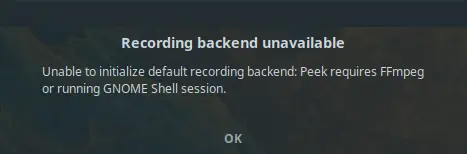

+++
title =  "Peek in Fedora"
date =   "2021-01-21"
description = "Installing and using Peek to record gif's."
[taxonomies]
tags = ["fedora","software"]
+++

[Peek](https://github.com/phw/peek) is an open source screen recorder for producing gif's.  It has an easy to use interface.  Once installed you open the app, position the see through frame over the part of the screen you want to record, and then press the record button...an example...


When you have finished recording you press 'stop' and finally give the .gif file a name.

The current Peek version:


## Installing Peek

To install Peek on Fedora open a terminal and type:
```bash
$ sudo dnf install Peek
```
When opening Peek for the first time you may get the following error message:



If this happens you may need to install ffmpeg, which processes video and audio files:
```bash
$ sudo dnf install ffmpeg
```

Opening the app should now work.


